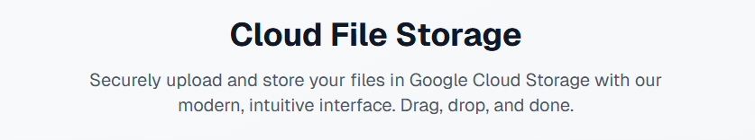
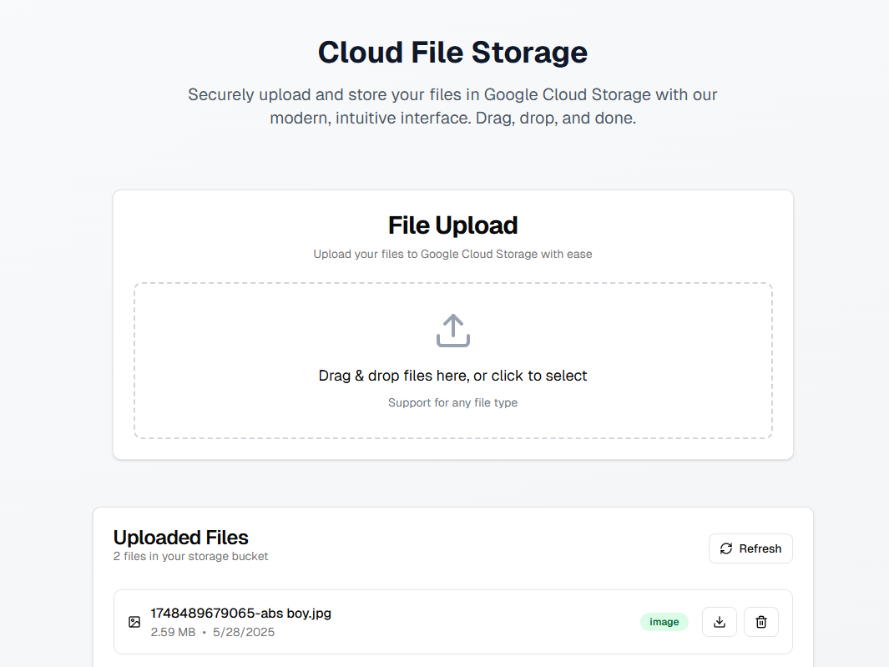

# Cloud File Upload Application



A modern, full-stack file upload application built with Next.js, TypeScript, and Google Cloud Storage. Features a clean, intuitive interface with drag-and-drop functionality and real-time upload progress.

## Features

- 🚀 **Modern UI**: Built with Next.js 15, Tailwind CSS, and shadcn/ui components.
- 📁 **Drag & Drop**: Intuitive file upload with drag-and-drop support
- ☁️ **Cloud Storage**: Direct integration with Google Cloud Storage.
- 📊 **Progress Tracking**: Real-time upload progress indicators
- 🎨 **Responsive Design**: Works seamlessly on desktop and mobile.
- 🔒 **Type Safe**: Full TypeScript support for better development experience
- ⚡ **Fast**: Optimized with Next.js App Router and Turbopack.

## Demo



The application provides a clean, modern interface for uploading files to Google Cloud Storage with real-time progress tracking and file management capabilities.

## Tech Stack

- **Frontend**: Next.js 15, React 19, TypeScript
- **Styling**: Tailwind CSS, shadcn/ui
- **Backend**: Next.js API Routes
- **Storage**: Google Cloud Storage
- **File Handling**: react-dropzone, multer
- **Icons**: Lucide React

## Prerequisites

Before you begin, ensure you have:

- Node.js 18+ installed
- A Google Cloud Platform account
- A Google Cloud Storage bucket created
- Google Cloud service account with Storage Admin permissions

## Setup Instructions

### 1. Clone and Install

```bash
git clone <your-repo-url>
cd file-upload-app
npm install
```

### 2. Google Cloud Setup

1. **Create a Google Cloud Project** (if you haven't already)
2. **Enable the Cloud Storage API**
3. **Create a Storage Bucket**:
   ```bash
   gsutil mb gs://your-bucket-name
   ```
4. **Create a Service Account**:
   - Go to IAM & Admin > Service Accounts
   - Create a new service account
   - Assign "Storage Admin" role
   - Generate and download a JSON key file

### 3. Environment Configuration

Create a `.env.local` file in the root directory:

```env
# Google Cloud Storage Configuration
GOOGLE_CLOUD_PROJECT_ID=your-project-id
GOOGLE_CLOUD_STORAGE_BUCKET=your-bucket-name
GOOGLE_CLOUD_KEY_FILE=./path/to/your/service-account-key.json

# Alternative: Use service account key content directly (base64 encoded)
# GOOGLE_CLOUD_CREDENTIALS=your-base64-encoded-service-account-key
```

### 4. Service Account Key

Place your Google Cloud service account JSON key file in the project root or specify the path in the environment variable.

### 5. Run the Application

```bash
# Development mode
npm run dev

# Production build
npm run build
npm start
```

The application will be available at `http://localhost:3000`.

## Usage

1. **Upload Files**: Drag and drop files onto the upload area or click to select files
2. **Monitor Progress**: Watch real-time upload progress for each file
3. **View Results**: Successfully uploaded files will show a checkmark and public URL
4. **Remove Files**: Click the X button to remove files from the upload list

## Project Structure

```
src/
├── app/
│   ├── api/upload/          # API route for file uploads
│   ├── globals.css          # Global styles
│   ├── layout.tsx           # Root layout
│   └── page.tsx             # Home page
├── components/
│   ├── ui/                  # shadcn/ui components
│   │   ├── button.tsx
│   │   ├── card.tsx
│   │   └── progress.tsx
│   └── FileUpload.tsx       # Main file upload component
├── config/
│   └── storage.ts           # Google Cloud Storage configuration
└── lib/
    └── utils.ts             # Utility functions
```

## Configuration Options

### Storage Configuration

The application supports two methods for Google Cloud authentication:

1. **Service Account Key File** (Recommended for development):
   ```env
   GOOGLE_CLOUD_KEY_FILE=./service-account-key.json
   ```

2. **Base64 Encoded Credentials** (Recommended for production):
   ```env
   GOOGLE_CLOUD_CREDENTIALS=base64-encoded-service-account-json
   ```

### Bucket Permissions

Ensure your Google Cloud Storage bucket has the appropriate permissions:

- Service account needs "Storage Admin" role
- For public file access, configure bucket permissions accordingly

## Deployment

### Vercel (Recommended)

1. Push your code to GitHub
2. Connect your repository to Vercel
3. Add environment variables in Vercel dashboard
4. Deploy

### Other Platforms

The application can be deployed to any platform that supports Node.js:

- Netlify
- Railway
- Heroku
- Google Cloud Run
- AWS Amplify

## Security Considerations

- Never commit service account keys to version control
- Use environment variables for all sensitive configuration
- Consider implementing file type restrictions
- Add file size limits as needed
- Implement user authentication for production use

## Contributing

1. Fork the repository
2. Create a feature branch
3. Make your changes
4. Add tests if applicable
5. Submit a pull request

## License

This project is licensed under the MIT License - see the LICENSE file for details.

## Support

For issues and questions:

1. Check the [Issues](https://github.com/your-repo/issues) page
2. Create a new issue with detailed information
3. Include error messages and steps to reproduce

## Acknowledgments

- [Next.js](https://nextjs.org/) for the amazing framework
- [shadcn/ui](https://ui.shadcn.com/) for beautiful components
- [Google Cloud Storage](https://cloud.google.com/storage) for reliable file storage
- [react-dropzone](https://react-dropzone.js.org/) for drag-and-drop functionality
